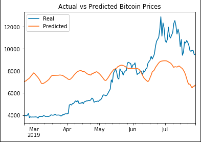

# LSTM Stock Predictor - Analysis

Of the two models tested, the model utilizing closing prices as the input resulted in slightly lower loss.  After 10 epochs, the sum of mean squared error was 0.0121.  Evaluating this model resulted in a loss of 0.0085.  On the other hand, the model based on the fear and greed index resulted in slightly higher error and loss: a sum of mean squared error of 0.0429 after 10 epochs and a model loss of 0.0706.

                                                                          
         
                Closing Prices                                 Fear And Greed Index

When graphing the predictions of these two models, closing prices appears to track the actual values better over time.  Fear and Greed results in predicted prices that are within $6,000 and $10,000, and usually close to $8,000.  As a result, these predicted prices are roughly $3,000 higher than actual prices up until about May.  At that point, they track fairly well for about a month, and then actual prices jump much higher than predicted prices, even though predicted prices show a slight rise.  

It’s also worth noting that while closing prices tracks better than Fear And Greed, it does not appear to have much predictive value.  In general, the price movement in the predictions happens after any movement occurs in the actual Bitcoin price.

           Fear And Greed Index - 50 Epochs

In experimenting with some of the features of this neural network, I found that increasing the number of epochs from 10 to 50 resulted in a slightly better Fear and Greed Index model result.  The predicted values from June onward are much closer to the actual values (which rise up to over $12,000 and then fall back to around $10,000).  However, the predictions still do not model the actual values well before June.

                                           

          1 Window                                                          5 Windows

Tweaking the window size resulted in significant changes to the predictions values.  When the window size was set to 1, the predictions were nearly identical regardless of date.  As a result, the graph consisted of a line with a slope of almost 0 around the $5,400 price value.  As the window size was increased, the graph more closely resembled the original curve of predicted values.

- - -

# LSTM Stock Predictor

Due to the volatility of cryptocurrency speculation, investors will often try to incorporate sentiment from social media and news articles to help guide their trading strategies. One such indicator is the [Crypto Fear and Greed Index (FNG)](https://alternative.me/crypto/fear-and-greed-index/) which attempts to use a variety of data sources to produce a daily FNG value for cryptocurrency. You have been asked to help build and evaluate deep learning models using both the FNG values and simple closing prices to determine if the FNG indicator provides a better signal for cryptocurrencies than the normal closing price data.

In this assignment, you will use deep learning recurrent neural networks to model bitcoin closing prices. One model will use the FNG indicators to predict the closing price while the second model will use a window of closing prices to predict the nth closing price.

You will need to:

1. [Prepare the data for training and testing](#prepare-the-data-for-training-and-testing)
2. [Build and train custom LSTM RNNs](#build-and-train-custom-lstm-rnns)
3. [Evaluate the performance of each model](#evaluate-the-performance-of-each-model)

- - -

### Files

[Closing Prices Starter Notebook](Starter_Code/lstm_stock_predictor_closing.ipynb)

[FNG Starter Notebook](Starter_Code/lstm_stock_predictor_fng.ipynb)

- - -

## Instructions

### Prepare the data for training and testing

Use the starter code as a guide to create a Jupyter Notebook for each RNN. The starter code contains a function to create the window of time for the data in each dataset.

For the Fear and Greed model, you will use the FNG values to try and predict the closing price. A function is provided in the notebook to help with this.

For the closing price model, you will use previous closing prices to try and predict the next closing price. A function is provided in the notebook to help with this.

Each model will need to use 70% of the data for training and 30% of the data for testing.

Apply a MinMaxScaler to the X and y values to scale the data for the model.

Finally, reshape the X_train and X_test values to fit the model's requirement of samples, time steps, and features. (*example:* `X_train = X_train.reshape((X_train.shape[0], X_train.shape[1], 1))`)

### Build and train custom LSTM RNNs

In each Jupyter Notebook, create the same custom LSTM RNN architecture. In one notebook, you will fit the data using the FNG values. In the second notebook, you will fit the data using only closing prices.

Use the same parameters and training steps for each model. This is necessary to compare each model accurately.

### Evaluate the performance of each model

Finally, use the testing data to evaluate each model and compare the performance.

Use the above to answer the following:

> Which model has a lower loss?
>
> Which model tracks the actual values better over time?
>
> Which window size works best for the model?

- - -

### Resources

[Keras Sequential Model Guide](https://keras.io/getting-started/sequential-model-guide/)

[Illustrated Guide to LSTMs](https://towardsdatascience.com/illustrated-guide-to-lstms-and-gru-s-a-step-by-step-explanation-44e9eb85bf21)

[Stanford's RNN Cheatsheet](https://stanford.edu/~shervine/teaching/cs-230/cheatsheet-recurrent-neural-networks)

- - -

### Hints and Considerations

Experiment with the model architecture and parameters to see which provides the best results, but be sure to use the same architecture and parameters when comparing each model.

For training, use at least 10 estimators for both models.

- - -

### Submission

* Create Jupyter Notebooks for the homework and host the notebooks on GitHub.

* Include a Markdown that summarizes your homework and include this report in your GitHub repository.

* Submit the link to your GitHub project to Bootcamp Spot.

- - -

© 2019 Trilogy Education Services, a 2U, Inc. brand. All Rights Reserved.
